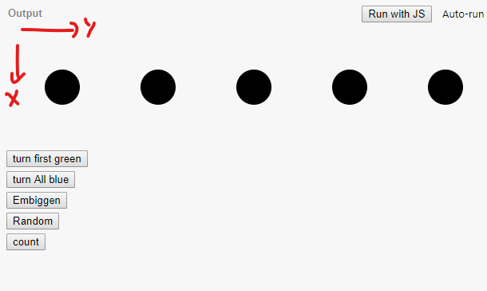

#  Intro

D3 stands for  D3 *Data-Driven Documents*.

It is a JS library used to create data visualizations in web browsers.  It makes use of SVG, HTML and CSS.

It relies heavily on the DOM and feels a bit like jquery to a degree. Elements can be selected and manipulated with CSS.

Once elements are selected, you can associate them with data as well.  This is where the data driven comes in.  Once an element is bound to data, it can be rendered in any number of ways.

Lets start with a simple example:

https://jsbin.com/yiyuqic/edit?html,css,js,output

In this example, we have already specified a bit of HTML

```
<svg width="760" height="140">
		<g transform="translate(70, 70)">
			<circle r="22" />
			<circle r="22" cx="120" />
			<circle r="22" cx="240" />
			<circle r="22" cx="360" />
			<circle r="22" cx="480" />
		</g>
	</svg>
```
It is an SVG of 5 circles.  Spread out horizontally and transformed a bit out to see the items.  Note in your browser, the Y count goes down.



