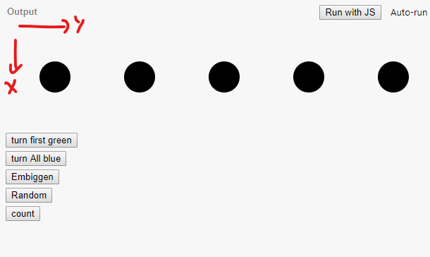
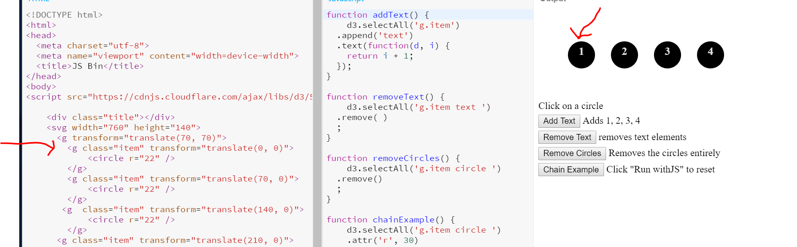

#  Intro

D3 stands for  D3 *Data-Driven Documents*.

It is a JS library used to create data visualizations in web browsers.  It makes use of SVG, HTML and CSS.

It relies heavily on the DOM and feels a bit like jquery to a degree. Elements can be selected and manipulated with CSS.

Once elements are selected, you can associate them with data.  This is where the data driven comes in.  Once an element is bound to data, it can be rendered in any number of ways.

## Selection

The first thing you need to know is how to access the DOM.  This is done with selections.  There are two basic functions.

- select()  - Select the first item that matches the query
- selectAll() - Select all items that match the query

Lets start with a simple example:

https://jsbin.com/yiyuqic/edit?html,css,js,output

In this example, we have already specified a bit of HTML

```
<svg width="760" height="140">
		<g transform="translate(70, 70)">
			<circle r="22" />
			<circle r="22" cx="120" />
			<circle r="22" cx="240" />
			<circle r="22" cx="360" />
			<circle r="22" cx="480" />
		</g>
	</svg>
```
It is an SVG of 5 circles.  Spread out horizontally and transformed a bit out to see the items.  Note in your browser, the Y values goes down.




Simple functions can use D3 to select items by class, id or other CSS tags and then change their respective styles/attributes.

```
function updateTwo() {
	d3.selectAll('circle')
	.style('fill', 'blue')
}
```
In the above case, we are selecting all the elements that are circles and setting their style to blue.

We can put functions in there as well

```
function count() {
	d3.selectAll('circle')
	 
  .attr('r', function(d, i) {
    return 10 + i*i;
  })
}
```

In this case, the "d" is the data (which is undefined as of yet, and i is the index. This will make the circles get progressively bigger.

Actions such as mouse in, out, and click can be attached to the dom as well

```
d3.selectAll('circle')
  .on('click', function(d, i) {
    d3.select('.status')
      .text('You clicked on circle ' + i);
    d3.select(this)
      .style('fill', 'purple');
  });
```

## Append and Remove - Simple

Once you have access to the parts of the DOM, you can modify it. Pretty much just like JQuery.

Here is an example of append and remove.

https://jsbin.com/saboset/edit?html,css,js,console,output

In this case, we are starting again with some Pre-Configured SVG/HTML.

Text Elements ( or groups, divs, whatever ) can be appended to existing elements
by selecting the elements and appending to the DOM

~~~~
function addText() {
	d3.selectAll('g.item')
  .append('text')
  .text(function(d, i) {
      console.log(i)
    return i + 1;
  }); 
}
 
function removeText() {
	d3.selectAll('g.item text ')
  .remove('text')
  ; 
}

~~~~




## Chaining

Selection functions (usually) return the selection, so they can be chained over and over and even filtered

~~~~
function chainExample() {
	d3.selectAll('g.item circle ')
    .attr('r', 30)
    .style('fill', 'orange')
    .style('stroke', 'blue')
    .style('stroke-width', 5)
    .filter(function(d,i) { return i % 2 == 0 })
    .remove( )
}
~~~~


Check out the section on Selections in: [D3 in Depth](https://www.d3indepth.com/selections/)

for basically the same examples in a little more detail.

So, now we know how to select stuff that was already there.
HOw do we put it up?


[Page 2](page2.md)
